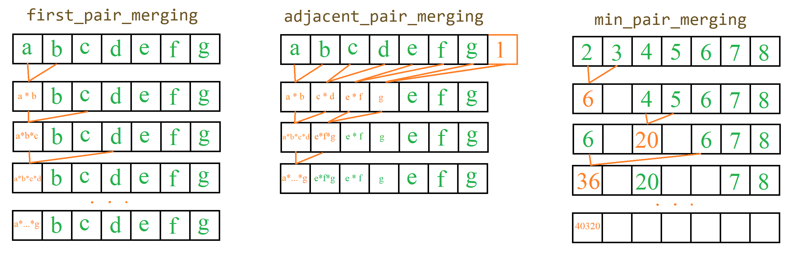

Чтобы можно было работать с большими факториалами нам потребуется изменения:
```py
import sys

# изменение глубины рекурсии
sys.setrecursionlimit(100000)

# изменение max размера длинной арифметики
sys.set_int_max_str_digits(100000)
```

В классической реализации факторила (что через рекурсию, что через цикл) мы постепенно накапливаем ответ, умножая на каждом шаге на "маленькие" числа (из промежутка $[1, n]$).

Однако, я вроде слышал, что лучше перемножать числа примерно одного порядка. \
Поэтому далее рассмотрим ещё варианты как можно подсчитать факториал, в конце значения и скорость будут сравниваться с библиотечной функцией: `math.factorial(n)`.


### Свёртка промежутка

При рефакторинге, было замечено, что по сути везде используются только три варианта перемножения промежутка чисел:


- `first_pair_merging` - Последовательное умножение первого аргумента на остальные (как в классическом подсчете факториала).
- `adjacent_pair_merging` - Поэтапное перемножение соседей: 1-го и 2-го, 3-го и 4-го, и т.д. В итоге на каждом этапе значений стновится в два раза меньше (для эффективности реализации всё происходит в одном списке).
- `min_pair_merging` - Объединие двух минимальных значений на каждом этапе. Для эффективного поиска и извлечения минимума, а также вставки нового элемента, использаволась структура `heapq`.
    ```py
    import heapq
    data = [...]
    heapq.heapify(data)
    min1 = heapq.heappop(data)
    min2 = heapq.heappop(data)
    heapq.heappush(data, min1*min2)
    ```

Поэтому во всех функциях появился дополнительный аргумент: `merging` - функция сворачивающая промежуток чисел в одно число. \
В данный момент у каждой функции рассмотриваеся только один вариант `merging`-а, по хорошему, можно для каждого способа подсчета факториала перебрать все три способа сворачивания и выбать лучший.


### Различные варианты подсчета факториала: 

* `factorial` - библиотечная функция

*  `fact_recursive` - вычисление через рекурсию

* `fact_classic` - вычисление через привычный цикл (вызов `first_pair_merging` на числах $[1, n]$)

* `fact_classic_1` - предварительный `shuffle` промежутка $[1, n]$ (в надежде что в произведениях будут числа примерно одного порядка) и затем вызов `adjacent_pair_merging`

* `fact5` - вызов `min_pair_merging` на числах $[1, n]$

* `fact3` - изначально, я почему то решил что использование приоритетной очереди на $n \sim 10^4$ достаточно затратно (хотя теперь кажется что на таких малых списках это буквально 10ms и смысла в этой оптимизации нет), поэтому это способ доставать числа "примерно" одного порядка за $O(1)$ амортизированно. \
Будем использовать две отсортированные очереди $A=[]$ и $B=[1,2, ..., n]$ - условно говоря в $A$ храняться значения порядка $x$, а в $B$ - значения порядка $x^2$ и более. \
Если в $A$ меньше чем $2$ элемена, то перетаскиваем их из $B$. \
Далее, пока $B[0] < A[0] \cdot A[1]$ мы будем перетаскивать $B[0]$ в конец $A$. \
Затем удаляем $A[0]$ и $A[1]$, и записываем элемент $A[0] \cdot A[1]$ в начало $B$.

* `fact3_1` - сравнение не самих (возможно очень длинных) чисел $B[0]$ и $A[0] \cdot  A[1]$, а просто количества знаков в них: `B[0].bit_length()`. \
Но это не дало почти никакого приимущества - действительно, наверное у больших чисел навряд ли совпадет количество "цифр" и питон при сравнени наверное смотрит сначала на разрядность и только потом начинает посимвольное сравнивнение


