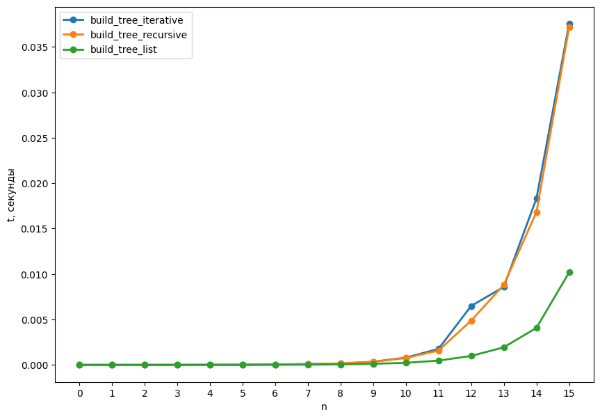

### Рекурсивная реализация
Подробнее это разбиралось в [lab3](../lab3).
```py
def build_tree_recursive(h, r, f, g):
    return { r : [build_tree_recursive(h-1, F(r), f, g) for F in [f, g]] if h > 0 else [] }
```

### Дерево в виде массива
В нерекурсивном построении, будем хранить дерево как просто 0-индексированный массив `TreeList` на $2^{h+1} - 1$ элемент. \
Корень имеет значение равное `TreeList[0]`. \
Для вершины со значением по индексу $i$, левый потомок имеет значение в индексе $2 i +1$, правый - в индексе $2 i+2$.

Зная функция `f` и `g` (которые по значению в текущем узле возвращают  значение для левого / правого потомка) мы можем просто проитерировать по всем $i$:
```py
TreeList[0] = root_value
for i in range(2**h - 1):
    TreeList[2*i+1] = f(TreeList[i])
    TreeList[2*i+2] = g(TreeList[i])
```

Итого мы получим какое-то из представлений дерева.

### Дерево в формате как и у build_tree_recursive
Для этого будем строить дерево "снизу". \
У нас уже есть `TreeList`, индексы из промежутка $[2^l-1, 2^{l+1}-1)$ - соответствуют слою дерева на глубине $l$.

Будем строить итоговое дерево по слоям `TreeLayer`. \
Самый нижний слой это листья: `TreeLayer = [ {x : []} for x in TreeList[2**h-1:] ]`. \
Дальше мы строим следующий слой по предыдущему как: `{TreeList[i] : [TreeLayer[j], TreeLayer[k]] }`, где индексы $i$, $j$, $k$ аккуратно выражаются.

Итого:
```py
def build_tree_iterative(h, r, f, g):
    TreeList = build_tree_list(h, r, f, g)

    N = 2**(h+1) - 1  # число вершин в дереве
    L = 2**h    # количество листьев в дереве

    shift = N - L
    TreeLayer = [ {x : []} for x in TreeList[shift:] ]

    while L > 1:
        L //= 2
        shift -= L
        newTreeLayer = [None] * L
        for i in range(L):
            newTreeLayer[i] =  { TreeList[shift + i] : [ TreeLayer[2*i], TreeLayer[2*i + 1] ] } 

        TreeLayer = newTreeLayer
        
    return TreeLayer[0]
```

Как же хорошо, что:
```py
print( build_tree_recursive(...) == build_tree_iterative(...) ) #True
```


### Результаты:

